[TOC]
# 一、概念

* MQTT 是基于 Publish/Subscribe 模式的物联网通信协议，凭借简单易实现、支持 QoS、报文小等特点，占据了物联网协议的半壁江山。
* MQTT（Message Queuing Telemetry Transport，消息队列遥测传输协议），是一种基于发布/订阅（publish/subscribe）模式的"轻量级"通讯协议，该协议构建于TCP/IP协议上，由IBM在1999年发布。MQTT最大优点在于，可以以极少的代码和有限的带宽，为连接远程设备提供实时可靠的消息服务。作为一种低开销、低带宽占用的即时通讯协议，使其在物联网、小型设备、移动应用等方面有较广泛的应用。
### 总结：
由上述可知,MQTT常用于物联网领域，基于订阅/发布模式，具有低开销，低带宽占用的特点。
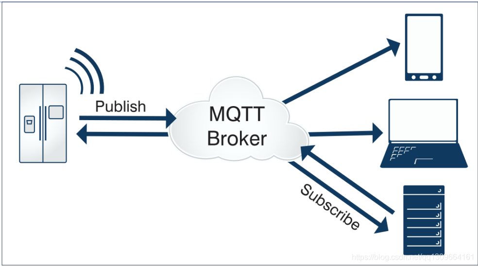
# 二、协议规范&&协议特点
* 由于物联网的环境是非常特别的，所以MQTT遵循以下设计原则：
    1.精简，不添加可有可无的功能；
    2.发布/订阅（Pub/Sub）模式，方便消息在传感器之间传递，解耦Client/Server模式，带来的好处在于不必预先知道对方的存在（ip/port），不必同时运行；
    3.允许用户动态创建主题（不需要预先创建主题），零运维成本；
    4.把传输量降到最低以提高传输效率；
    5.把低带宽、高延迟、不稳定的网络等因素考虑在内；
    6.支持连续的会话保持和控制（心跳）；
    7.理解客户端计算能力可能很低；
    8.提供服务质量（ quality of service level：QoS）管理；
    9.不强求传输数据的类型与格式，保持灵活性（指的是应用层业务数据）。
* MQTT协议工作在低带宽、不可靠的网络的远程传感器和控制设备通讯而设计的协议，它具有以下主要的几项特性：
    1.开放消息协议，简单易实现。
    2.使用发布/订阅消息模式，提供一对多的消息发布，解除应用程序耦合。
    3.对负载（协议携带的应用数据）内容屏蔽的消息传输。
    4.基于TCP/IP网络连接,提供有序，无损，双向连接。主流的MQTT是基于TCP连接进行数据推送的，但是同样有基于UDP的版本，叫做MQTT-SN。这两种版本由于基于不同的连接方式，优缺点自然也就各有不同了。
    5.消息服务质量（QoS）支持，可靠传输保证；
    6.1字节固定报头，2字节心跳报文，最小化传输开销和协议交换，有效减少网络流量。这就是为什么在介绍里说它非常适合"在物联网领域，传感器与服务器的通信，信息的收集，要知道嵌入式设备的运算能力和带宽都相对薄弱，使用这种协议来传递消息再适合不过了。
    7.在线状态感知：使用Last Will和Testament特性通知有关各方客户端异常中断的机制。Last Will：即遗言机制，用于通知同一主题下的其他设备，发送遗言的设备已经断开了连接。Testament：遗嘱机制，功能类似于Last Will。
### 总结：
所有的MQTT服务，都需要按照此规范进行设计和实现。这些规范我们了解即可，无需特别记忆。
# 三、Qos消息服务质量机制

<b>QoS0</b>
“至多一次”，消息发布完全依赖底层TCP/IP网络。会发生消息丢失或重复。这一级别可用于如下情况，环境传感器数据，丢失一次读记录无所谓，因为不久后还会有第二次发送。这一种方式主要普通APP的推送，倘若你的智能设备在消息推送时未联网，推送过去没收到，再次联网也就收不到了。
* TIPS:发出去就不管了，不管broker是否接收了！
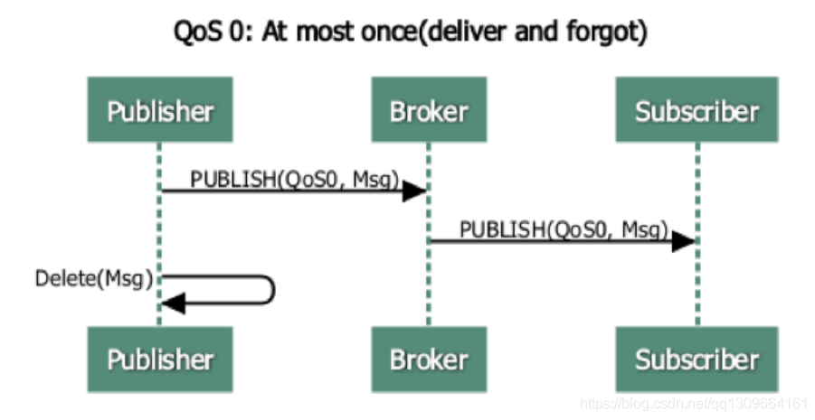

<b>QoS1</b>
“至少一次”，确保消息到达，但消息重复可能会发生。
* TIPS:至少一次的意思是一次性送达broker，则就发一次。如果没有送达broker，会继续发送，直到发送至broker。如果第一次发送没有得到broker的回应，发生了第二次发送，但此时第一次发送的消息发送到了broker，则此时会出现消息重复现象。从broker往消费者客户端发送也是同样的道理。
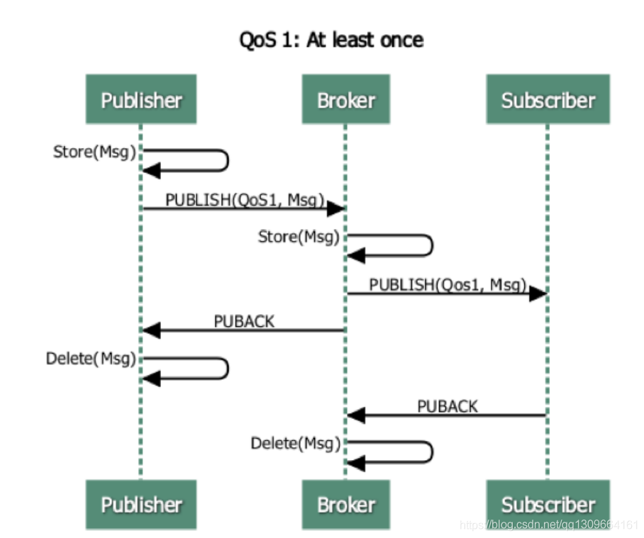

<b>QoS2</b>
“只有一次”，确保消息到达一次。在一些要求比较严格的计费系统中，可以使用此级别。在计费系统中，消息重复或丢失会导致不正确的结果。这种最高质量的消息发布服务还可以用于即时通讯类的APP的推送，确保用户收到且只会收到一次。
* 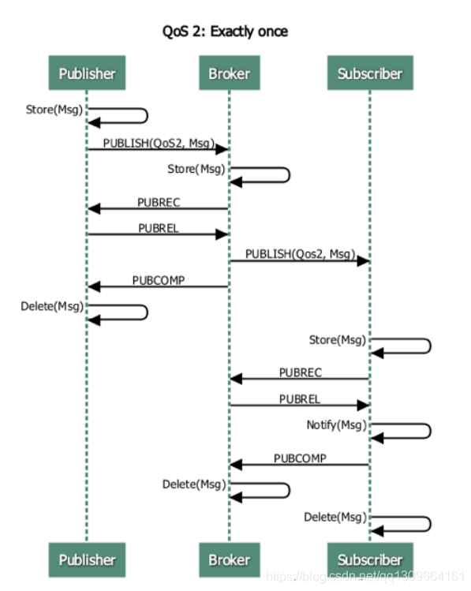

MQTT发布消息服务质量保证（QoS）不是端到端的，是客户端与服务器之间的。订阅者收到MQTT消息的QoS级别，最终取决于发布消息的QoS和主题订阅的QoS。
消息在生产者和broker之间定义了Qos,在消费者和broker之间定义了Qos，最终这条消息的Qos是取这两者之间的最低值。

# 四、 发布/订阅、主题、会话
* 发布/订阅
MQTT 是基于 发布(Publish)/订阅(Subscribe) 模式来进行通信及数据交换的，与 HTTP 的 请求(Request)/应 答(Response) 的模式有本质的不同。

  订阅者(Subscriber) 会向 消息服务器(Broker) 订阅一个 主题(Topic) 。成功订阅后，消息服务器会将该主题下的消息转发给所有的订阅者。
> * TIPS:这里需要注意，这里是把消息发送给订阅主题的所有消费者。
* 主题(Topic)
  以 ‘/’ 为分隔符区分不同的层级。包含通配符 ‘+’ 或 ‘#’ 的主题又称为 主题过滤器(Topic Filters);
‘+’: 表示通配一个层级，例如a/+，匹配a/x, a/y
‘#’: 表示通配多个层级，例如a/#，匹配a/x, a/b/c/d
注: ‘+’ 通配一个层级，’#’ 通配多个层级(必须在末尾)。

* 会话(session)
  每个客户端与服务器建立连接后就是一个会话，客户端和服务器之间有状态交互。会话存在于一个网络之间，也可能在客户端和服务器之间跨越多个连续的网络连接。

# 五、 MQTT协议中的方法
MQTT协议中定义了一些方法（也被称为动作），来于表示对确定资源所进行操作。这个资源可以代表预先存在的数据或动态生成数据，这取决于服务器的实现。通常来说，资源指服务器上的文件或输出。主要方法有：
1. CONNECT：客户端连接到服务器
2. CONNACK：连接确认
3. PUBLISH：发布消息
4. PUBACK：发布确认
5. PUBREC：发布的消息已接收
6. PUBREL：发布的消息已释放
7. PUBCOMP：发布完成
8. SUBSCRIBE：订阅请求
9. SUBACK：订阅确认
10. UNSUBSCRIBE：取消订阅
11. UNSUBACK：取消订阅确认
12. PINGREQ：客户端发送心跳
13. PINGRESP：服务端心跳响应
14. DISCONNECT：断开连接
15. AUTH：认证
# 六、MQTT协议数据包结构
在MQTT协议中，一个MQTT数据包由：固定头（Fixed header）、可变头（Variable header）、消息体（payload）三部分构成。MQTT数据包结构如下：
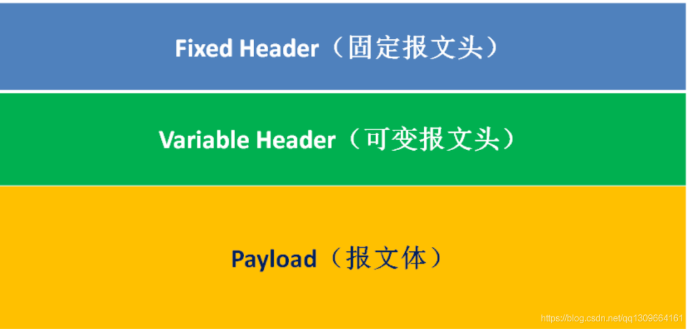
* （1）固定头（Fixed header）。存在于所有MQTT数据包中，表示数据包类型及数据包的分组类标识，如连接，发布，订阅，心跳等。其中固定头是必须的，所有类型的MQTT协议中，都必须包含固定头。

* （2）可变头（Variable header）。存在于部分MQTT数据包中，数据包类型决定了可变头是否存在及其具体内容。可变头部不是可选的意思，而是指这部分在有些协议类型中存在，在有些协议中不存在。

* （3）消息体（Payload）。存在于部分MQTT数据包中，表示客户端收到的具体内容。与可变头一样，在有些协议类型中有消息内容，有些协议类型中没有消息内容。

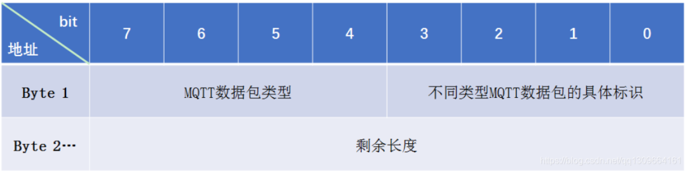
固定头存在于所有MQTT数据包中， 固定头包含两部分内容，首字节(字节1)和剩余消息报文长度(从第二个字节开始，长度为1-4字节)，剩余长度是当前包中剩余内容长度的字节数，包括变量头和有效负载中的数据）。剩余长度不包含用来编码剩余长度的字节。

剩余长度使用了一种可变长度的结构来编码，这种结构使用单一字节表示0-127的值。大于127的值如下处理。每个字节的低7位用来编码数据，最高位用来表示是否还有后续字节。因此每个字节可以编码128个值，再加上一个标识位。剩余长度最多可以用四个字节来表示。

#### 数据包类型

位置：第一个字节(Byte 1) 中的7-4个bit位(Bit[7-4])，表示4位无符号值
通过第一个字节的高4位确定消息报文的类型，4个bit位能确定16种类型，其中0000和1111是保留字段。
MQTT消息报文类型如下：
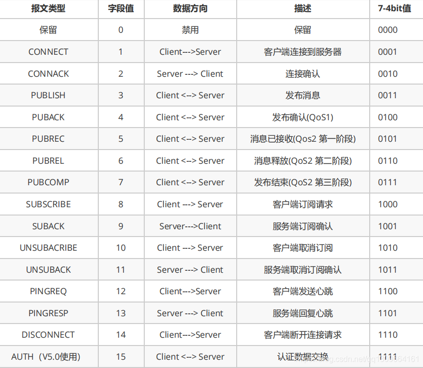
#### 标志位
位置：第一个字节中的0-3个bit位(Bit[3-0])。意思是字节位Bit[3-0]用作报文的标识。
首字节的低4位(bit3~bit0)用来表示某些报文类型的控制字段，实际上只有少数报文类型有控制位，如下图：
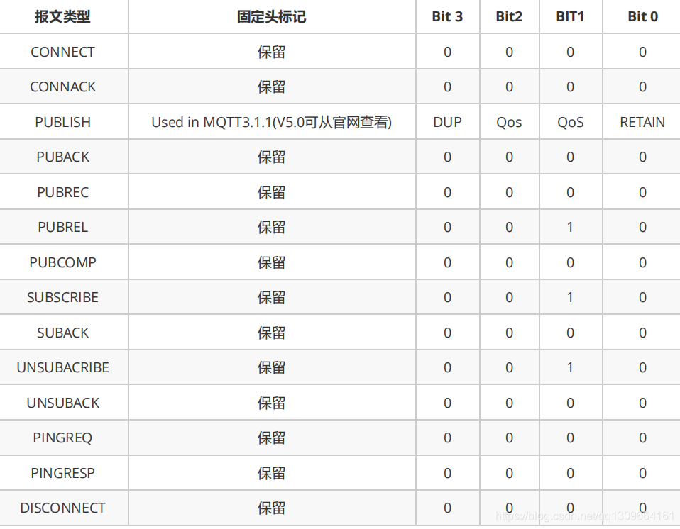
* （1）：其中Bit[3]为DUP字段，如果该值为1，表明这个数据包是一条重复的消息；否则该数据包就是第一次发布的消息。
* （2）：Bit[2-1]为Qos字段：
如果Bit 1和Bit 2都为0，表示QoS 0：至多一次；
如果Bit 1为1，表示QoS 1：至少一次；
如果Bit 2为1，表示QoS 2：只有一次；
如果同时将Bit 1和Bit 2都设置成1，那么客户端或服务器认为这是一条非法的消息，会关闭当前连接。
#### 可变头(Variable Header)
可变头的意思是可变化的消息头部。有些报文类型包含可变头部有些报文则不包含。可变头部在固定头部和消息内容之间，其内容根据报文类型不同而不同。
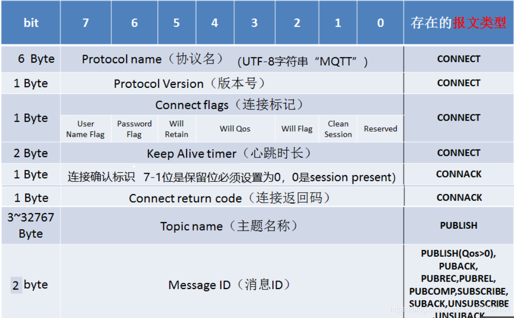
#### 协议名
协议名是表示协议名MQTT的UTF-8编码的字符串。MQTT规范的后续版本不会改变这个字符串的偏移和长度。
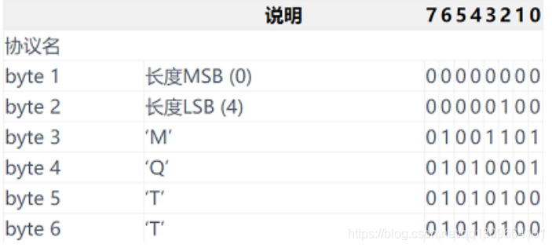
支持多种协议的服务端使用协议名字段判断数据是否为MQTT报文。协议名必须是UTF-8字符串“MQTT”。如果服务端不愿意接受CONNECT但希望表明其MQTT服务端身份，可以发送包含原因码为0x84（不支持的协议版本）的CONNACK报文，然后必须关闭网络连接

#### 协议版本
位无符号值表示客户端的版本等级。3.1.1版本的协议等级是4，MQTT v5.0的协议版本字段为5（0x05）

#### MQTT会话(Clean Session)
MQTT客户端向服务器发起CONNECT请求时，可以通过’Clean Session’标志设置会话。
‘Clean Session’设置为0，表示创建一个持久会话，在客户端断开连接时，会话仍然保持并保存离线消息，直到会话超时注销。
‘Clean Session’设置为1，表示创建一个新的临时会话，在客户端断开时，会话自动销毁。
#### Will Flag/Will Qos/Will Retain
如果Will Flag被设置为1，这意味着，如果连接请求被接受，服务端必须存储一个Will Message，并和网络连接关联起来。之后在网络连接断开的时候必须发布Will Message，除非服务端收到DISCONNECT包删掉了Will Message
Will Message会在某些情况下发布，包括但不限于：
* 服务端发现I/O错误或网络失败。
* 客户端在Keep Alive时间内通信失败。
* 客户端没有发送DISCONNECT包就关闭了网络连接。
* 服务端因协议错误关闭了网络连接。

如果Will Flag被设置为1，连接标识中的Will QoS和Will Retain字段将会被服务端用到Will QoS这两个bit表示发布Will Message时使用QoS的等级
Will Retain这个bit表示Will Message在发布之后是否需要保留。
如果Will Flag设置为0，那么Will Retain必须是0
如果Will Flag设置为1：
如果Will Retain设置为0，那么服务端必须发布Will Message，不必保存
如果Will Retain设置为1，那么服务端必须发布Will Message，并保存
#### MUser Name Flag
如果User Name Flag设置为0，那么用户名不必出现在载荷中
如果User Name Flag设置为1，那么用户名必须出现在载荷中
#### Password Flag
如果Password Flag设置为0，那么密码不必出现在载荷中
如果Password Flag设置为1，那么密码必须出现在载荷中
如果User Name Flag设置为0，那么Password Flag必须设置为0
#### MQTT连接保活心跳
心跳的作用：
> PINGREQ包从客户端发往服务端，可以用来：
1：在没有其他控制包从客户端发送给服务端的时候，告知服务端客户端的存活状态。
2：请求服务端响应，来确认服务端是否存活。
3：确认网络连接的有效性。PINGRESP包从服务端发送给客户端来响应PINGREQ包。它代表服务端是存活的。

    MQTT客户端向服务器发起CONNECT请求时，通过KeepAlive参数设置保活周期。
Keep Alive是以秒为单位的时间间隔。用2字节表示，它指的是客户端从发送完成一个控制包到开始发送下一个的最大时间间隔。客户端有责任确保两个控制包发送的间隔不能超过Keep Alive的值。如果没有其他控制包可发，客户端必须发送PINGREQ包。
客户端可以在任何时间发送PINGREQ包，不用关心Keep Alive的值，用PINGRESP来判断与服务端的网络连接是否正常。
如果Keep Alive的值非0，而且服务端在一个半Keep Alive的周期内没有收到客户端的控制包，服务端必须作为网络故障断开网络连接。
如果客户端在发送了PINGREQ后，在一个合理的时间都没有收到PINGRESP包，客户端应该关闭和服务端的网络连接。
Keep Alive的值为0，就关闭了维持的机制。这意味着，在这种情况下，服务端不会断开静默的客户端。
#### MQTT遗愿消息(Last Will)
MQTT客户端向服务器端CONNECT请求时，可以设置是否发送遗愿消息(Will Message)标志，和遗愿消息主题(Topic)与内容(Payload)。
MQTT客户端异常下线时(客户端断开前未向服务器发送DISCONNECT消息)，MQTT消息服务器会发布遗愿消息。
常见的一种可变头比如：Packet Identifier(消息ID)
一个消息ID包含2字节，高字节在前，低字节在后。包含Packet Identifier的协议类型包括：
PUBLISH( QoS > 0 )、 PUBACK 、 PUBREC 、 PUBREL 、 PUBCOMP 、 SUBSCRIBE 、 SUBACK 、UNSUBSCRIBE 、 UNSUBACK
消息ID默认是从1开始并自增，如果一个消息ID被用完后，这个消息ID可以被重用。对于PUBLISH (QoS 1)来说，如果发送端接收到PUBACK，那么这个消息ID就用完了。对于PUBLISH(QoS 2)，如果接收方收到PUBCOMP，那么这个消息ID就用完了。对于SUBSCRIBE和UNSUBSCRIBE，消息ID使用完成的标记是发送方收到了对应的SUBACK和UNSUBACK。
另外客户端和服务端的消息ID是独立分配的，客户端和服务端可以同时使用同一个消息ID。
#### 消息体(Payload)
有些报文类型是包含Payload的，Payload意思是消息载体的意思
如PUBLISH的Payload就是指消息内容（应用程序发布的消息内容）。而CONNECT的Payload则包含ClientIdentifier，Will Topic，Will Message，Username，Password等信息。
包含payload的报文类型如下：
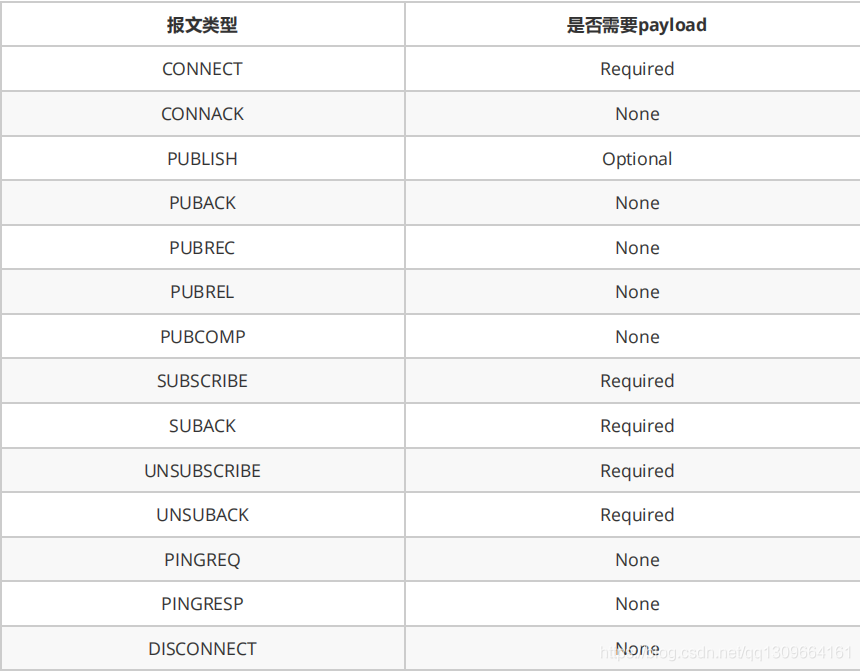
### 总结：
* 我们介绍了MQTT协议的消息格式，MQTT消息格式包含Fixed Header， Variable Header和Payload。因为MQTT消息格式非常精简，所以可以高效的传输数据。
* Fixed Header中包含首字节，高4位用来表示报文类型，低4位用于类型控制。目前只有PUBLISH使用了类型控制字段。其它控制字段被保留并且必须与协议定义保持一致。
* Fixed Header同时包含Remaining Length，这是剩余消息长度，最大长度为4字节，理论上一条MQTT最大可以传输256MB数据。Remaining Length=Variable Header+Payload长度。
* Variable Header是可变头部，有些报文类型中需要包含可变头部，可变头部根据报文类型不同而不同。比如Packet Identifier在发布，订阅/取消订阅等报文中都使用到。
* Payload是消息内容，也只在某些报文类型中出现，其内容和格式也根据报文类型不同而不同。